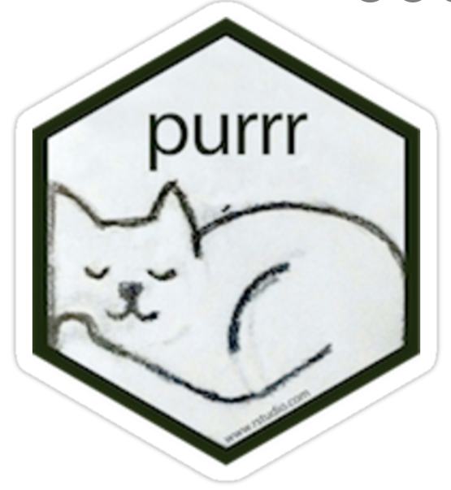

name: portada
class: center, middle

.linea-superior[]
.linea-inferior[]


## Capacitación en R y herramientas de productividad

## Proyecto Ciencia de Datos

## Introducción a _data frames_ y _tidyverse_


```{r setup, include=FALSE}
options(htmltools.dir.version = TRUE)
knitr::opts_chunk$set(message = FALSE) 
```

```{r xaringan-themer, include=FALSE, warning=FALSE}
library(xaringanthemer)
```


---

name: diapo-basica
background-image: url("imagenes/fondo2.PNG")
background-size: contain;
background-position: 100% 0%

# Introducción a dataframes y _tidyverse_
---
template: diapo-basica

Como mencionamos, los _data frames_ son la estructura de datos a la que nos enfrentaremos más comúnmente y en la que se enfoca este curso

--

Para trabajar con estos, el paquete `tidyverse` es de gran ayuda.

--

**Nota:** la implementación de los _data frames_ en el _tidyverse_ es llamada _tibble_

--

**¿Qué es tidyverse?** Es una serie de paquetes para el trabajo con _data frames_ que funcionan en harmonía, pues fueron programados con la misma filosofía y diseño de datos.

--

Incluye paquetes como:

  <p float="left">
    
   
   

  
   
   
  
  
   


</p>

Listado completo de paquetes [aquí](https://tidyverse.tidyverse.org/)

---
template: diapo-basica

Instalemos `tidyverse` y aprovechemos de instalar `guaguas` que nos proveerá datos
del número de personas nacidas con cada nombre en cada año:

```{r, eval = F}
install.packages('tidyverse')
install.packages('guaguas')
```
--

Luego los cargamos en nuestra sesión de la siguiente forma:

```{r, eval = T}
library(tidyverse)
library(guaguas)
```

---
template: diapo-basica

Carguemos la base en nuestro ambiente de trabajo:

```{r}
datos = guaguas
```

--

Algunas exploraciones básicas: 


Dimensiones:

--


```{r, echo = T, eval = T}

dim(datos)
```

--

N° de filas:

--

```{r, echo = T}

nrow(datos)
```

--

N° de columnas:

--

```{r, echo = T}

ncol(datos)
```

---
template: diapo-basica


Nombres de las columnas:

--

```{r, echo = T}

names(datos)
```

--

Tipos de datos y mirada inicial:

--

```{r, echo = T}

str(datos)
```

---
template: diapo-basica


Valores únicos de una variable:

--

```{r}

distinct(datos, sexo)

```

--

Conteo de valores únicos de una variable:

--


```{r}
count(datos, sexo)

```


---
template:portada